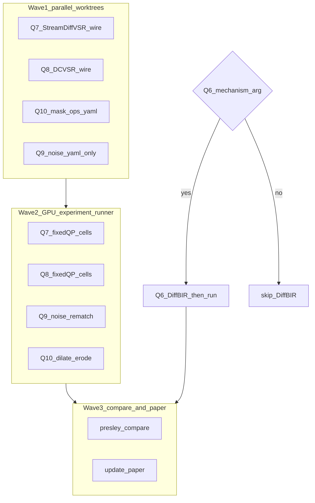

# Handoff — D6 write-up pushed; Q6–Q10 wave plan (2026-07-28)

## What triggered this handoff

D6 write-up tables landed and are ready to push; host-rule sync dirt cleared;
next session owns Q6–Q10 via the wave plan below (do not start GPU from this
doc alone — human-gate Q6; use worktrees for integrations).

## One-paragraph summary

Q1–Q5 closed. D6 write-up (`tab:breadth`, `tab:breadth-ext`, `tab:mask-sens`,
`tab:transport`, `tab:inpainters`) is in the paper repo. InstantIR kill stands;
keep Real-ESRGAN. Remaining queue is Q7/Q8 diffusion SR, Q9 noise rematch,
Q10 mask dilate/erode, and Q6 DiffBIR only with a new mechanism argument.

## Current state (after this session’s commits/pushes)

### Code repo `presley/`

- `main` — host-rule sync (`AGENTS.md`, cursor-harness) + queue/HANDOFF docs.
- Restorers: NAFNet + Real-HAT-GAN + BSRGAN + Real-ESRGAN + InstantIR + unsharp.
- **Hard rules:** NAFNet and Real-HAT-GAN reject `fp32=False`.

### Paper repo `68e8b6bb11d0dd9e62a67aef/`

- D6 tables + CLAIM markers in `sections/evaluation.tex`; RESEARCH_LOG and
  reviewers_comments updated. Overleaf tip after push (this session).

### Running now

Nothing PRESLEY-owned.

## Deferred / open HOLEs

- `HOLE(tab:av1)` n>2; `HOLE(tab:goal2/conditioned)` n>2;
  `HOLE(tab:priced-trade)` shrink_amount; `HOLE(sec:evaluation)` Q10 dilate.

## Ops gotchas

- Filter fixed-QP with **`codec=svtav1`**. Bare `restorer=` rematches VBR dirs.
- `fg_protect=True`. BG-PSNR never Goal-2 verdict. NAFNet/HAT **fp32 only**.
- Substantive code → worktree + branch (`feat/` / `exp/`). Run-only stays here.
- Bound metrics before reading (`results-report` / `gpu-job-runner`).

---

## Q6–Q10 — subagent wave plan (for the next session)

**Skipped for Q6 alone if no mechanism argument:** sequential skip is correct;
do not spawn DiffBIR work without human authorization.



### Wave 1 — parallel integrate (4 worktrees; no long GPU)

Launch together after creating worktrees. Prefer `experiment-runner` only in
Wave 2. Model tier: medium/high Grok for integration; inherit OK if parent is
already that tier.

| Stream | Branch / worktree | Agent | Deliverable |
|---|---|---|---|
| **A — Q7** | `../wt-presley/q7-stream-diffvsr` `-b feat/q7-stream-diffvsr` | generalPurpose | Wire `restorer: stream_diffvsr` in `restoration.py` / `presley_ai.py`; weights from HF `Jamichsu/Stream-DiffVSR`; fp16 policy documented; unit smoke on 1 frame; dry-run yaml entry |
| **B — Q8** | `../wt-presley/q8-dc-vsr` `-b feat/q8-dc-vsr` | generalPurpose | Same pattern for `restorer: dc_vsr`; HF `Janghyeok/dc-vsr`; dry-run yaml |
| **C — Q10** | `../wt-presley/q10-mask-noise` `-b feat/q10-mask-noise` | generalPurpose | Mask dilate/erode/jitter on UFO masks (2 DAVIS); yaml keys; stage-contract tests; fills `HOLE(sec:evaluation)` dilate half |
| **D — Q9** | stay on main checkout or tiny `exp/q9-noise-rematch` | generalPurpose | Yaml only: matched-budget noise vs blur/downsample after `filter_frame_noise` `round(score)>0` fix (already in code). `--dry-run` annotate hashes. No new restorer. |

**Wave 1 exit:** each stream pushes its branch; human merges or next session
merges green streams before Wave 2. Do not run multi-hour GPU on unmerged forks
that share `results/` unless the session owns this checkout.

**Q7/Q8 implementation landmarks:** mirror Real-HAT / Real-ESRGAN paths in
`src/presley/restoration.py` and dispatch in `presley_ai.py`; reject unsafe
fp16 if Softmax/LayerNorm NaNs appear; catalog already names the HF repos in
`docs/EXPERIMENTS_QUEUED.md`.

**Q10 landmarks:** `HOLE(sec:evaluation)` in evaluation.tex; erosion defeats
`fg_protect` — that failure mode is the point. Videos: bear + camel (or two
from the mask-sens set). Compare vs gt arm in `tab:mask-sens` recipe.

**Q9 landmarks:** RESEARCH_LOG noise dead-end (+213…+334%); rematch under
fixed QP with budget parity vs downsample/blur; expect noise still costs bits.

### Wave 2 — GPU cells (`experiment-runner` / background shell)

Depends on Wave 1 merges for Q7/Q8/Q10. Q9 can start as soon as Wave 1-D yaml
is on main.

Recipe: `CLAIM(tab:conditioned)` — bear+camel, bs8, sa=0.25, `fg_protect`,
**starved** SVT-AV1 fixed QP; filter `codec=svtav1`. Bound BG-LPIPS before
reading. `--dry-run` first.

| ID | Cells | Comparator |
|---|---|---|
| Q7 | downsample + `stream_diffvsr` | Real-ESRGAN `e2cb6bed165d69b1` / `c29c94b5c290f208` |
| Q8 | downsample + `dc_vsr` | same Real-ESRGAN |
| Q9 | noise (budget-matched) vs blur/downsample | baseline + prior noise hashes |
| Q10 | dilate / erode / jitter × 2 videos | gt mask elvis at same QP |

Use `experiment-runner` subagent or `presley-run …` with `block_until_ms: 0`.
Never hand-roll `pgrep` wait loops.

### Wave 3 — compare + paper

After Wave 2 `invariant_failures=[]`:
1. `presley-compare` pairwise / group-by
2. `/update-paper` → CLAIM lines; clear only filled HOLEs
3. Refresh RESEARCH_LOG, reviewers_comments (mask item → Done when Q10 lands),
   EXPERIMENTS_QUEUED, this HANDOFF

### Q6 DiffBIR (side gate, not in Wave 1)

| Gate | Requirement |
|---|---|
| Mechanism | Written argument why DiffBIR’s prior would beat NAFNet/unsharp on spatial-Gaussian+CRF blur — NAFNet already ties unsharp with no Goal-2 gain |
| If gated yes | Separate worktree `feat/q6-diffbir`; integrate; fixed-QP blur cells; compare vs unsharp + InstantIR-corrected + NAFNet |
| If gated no | Leave `HOLE(tab:instantir-kill)` DiffBIR line; do not commission |

## Prompt for the next session

```
Pick up HANDOFF.md in /home/itec/emanuele/presley.

D6 write-up is pushed. Q1–Q5 closed. Execute the Q6–Q10 wave plan in HANDOFF.md:
Wave 1 parallel worktrees (Q7/Q8/Q10 integrate + Q9 yaml), then Wave 2 GPU,
then Wave 3 compare+paper. Ask before Q6 DiffBIR (needs mechanism argument).

Read docs/EXPERIMENTS_QUEUED.md. Filter tip: codec=svtav1. fp32 for NAFNet/HAT.
```

## Landmarks

| Path | Why |
|---|---|
| `docs/EXPERIMENTS_QUEUED.md` | Queue status |
| `src/presley/restoration.py` / `presley_ai.py` | Restorer wiring pattern |
| `src/presley/degradation.py` `filter_frame_noise` | Q9 |
| Paper `HOLE(sec:evaluation)` | Q10 |
| Real-ESRGAN hashes `e2cb6bed…` / `c29c94b5…` | Q7/Q8 comparators |
